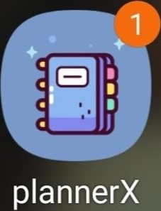
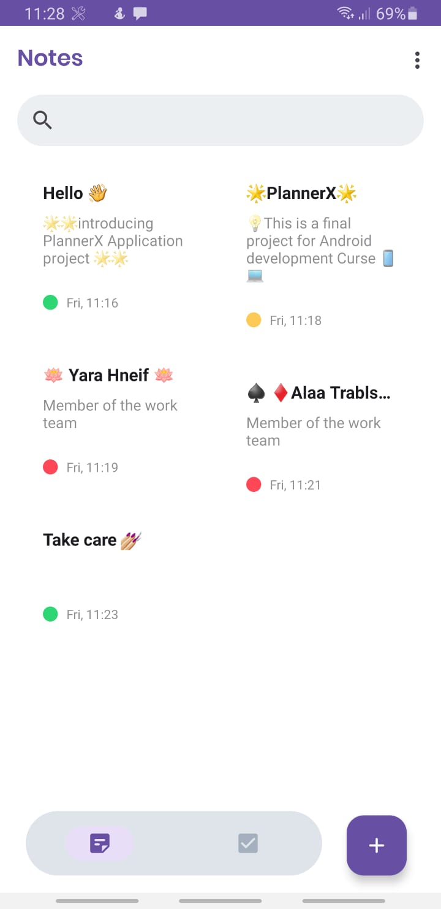
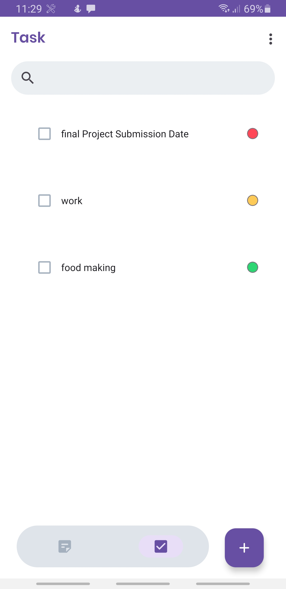
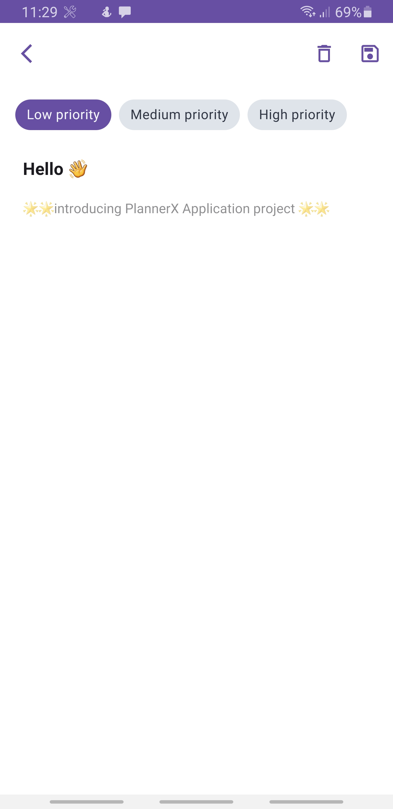
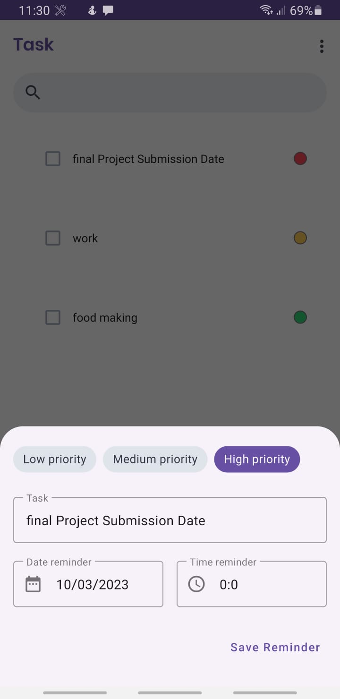
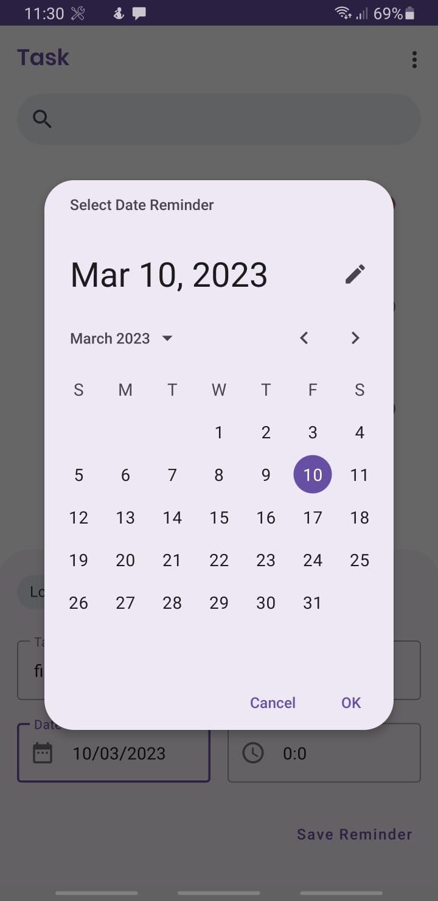
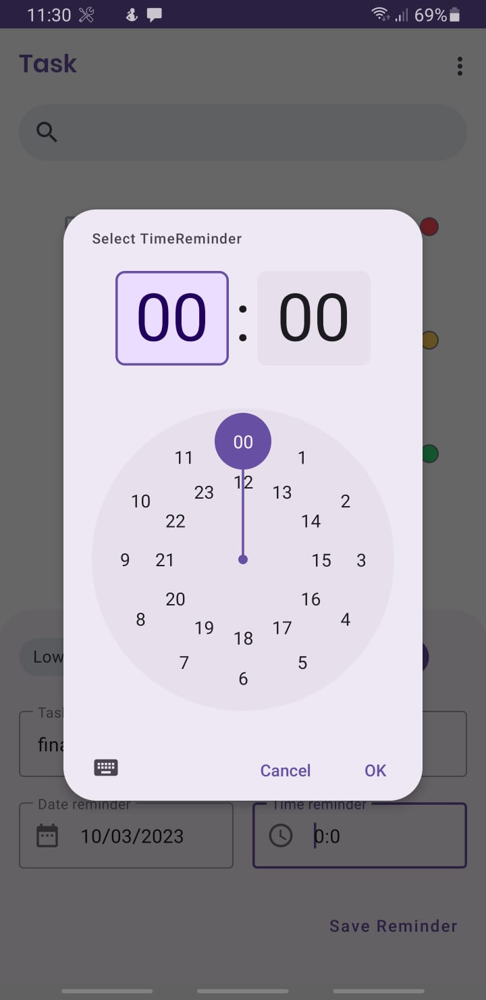

# <h1 align="center"> PlannerX </h1> 
 
   <h4 align="center"> Mobile Systems Software Workshop Final Project   PROJECT REPORT </h4>
   
 
   
  

  
## Introduction
PlannerX is an Android application designed to help users manage their daily tasks and activities and a note diary . The app allows users to create, edit, and delete tasks, set reminders, and organize tasks into categories. The PlannerX app is developed using Java and the Android SDK, and it is designed to run on Android devices running Android 5.0 (Lollipop) or later.
The PlannerX-AndroidAPP is a task management app for Android devices that allows users to create, manage, and organize their tasks and to-do lists. The app is designed to provide a simple and intuitive user interface that is easy to use and navigate, while also offering a wide range of features and customization options to meet the needs of different users.
The application functions to take notes, there is a priority label to categorize which priority is more important. In addition, this application also has a feature to add tasks reminder.
  

 
 
   

  

  
## Architecture
The PlannerX app follows the Model-View-ViewModel (MVVM) architecture pattern, which separates the app's code into three layers:
•	Model: The data layer, which includes the app's data objects and persistence logic.
•	View: The presentation layer, which includes the app's user interface and handles user input.
•	ViewModel: The logic layer, which handles communication between the Model and View layers.
The app's data objects are defined using Room entities, and the data is accessed using Room DAOs. The ViewModel layer provides the data to the View layer, which displays it using RecyclerViews and Material Design components. 
  
## Functionality
The PlannerX-AndroidAPP includes a wide range of features and functionality that allow users to manage their tasks in a variety of ways. Some of the key features of the app include:
Task creation: Users can create new tasks and to-do items, including setting due dates, reminders, and priorities.
Task editing: Users can edit and modify their existing tasks, including updating due dates, changing priority levels, and adding or removing reminders.
Task sorting: Users can sort their tasks by due date, priority, or completion status, making it easy to see which tasks are most urgent and which can be completed at a later time.
Category creation: Users can create and manage different categories for their tasks, allowing them to group related tasks together for easy management.
Category color selection: Users can select a color for each category, allowing them to visually distinguish between different categories in the app.
Home screen widget: Users can add a widget to their Android device's home screen that displays their current tasks and to-do items, making it easy to stay on top of their tasks without having to open the app.
Settings: Users can customize various settings in the app, including choosing their preferred date and time format, enabling or disabling sound and vibration notifications, and selecting a theme for the app.
  
 ### Features and Functionality
 
The PlannerX-AndroidAPP has several features and functionalities, including:
- Home screen with a Navigation bar. 
- list of tasks\notes organized by priority sorting filter.
-	Creating, editing, and deleting tasks\notes (swipe To Delete Feature).
-	Assigning tasks to categories.
- Setting due dates and reminders for tasks (NotificationHelper).
- Create and manage task categories.
-	Color-coded categories to help users quickly identify tasks.
- Sorting tasks by due date.
- Viewing tasks by category.
- Settings screen with options to customize the app's behavior and appearance.
- Support light & dark mode theme style by Material3.DayNight.NoActionBar .
 
## Development Process
The development process for the PlannerX app followed the following steps:
  1.	Requirement gathering: The requirements for the app were defined by analyzing user needs and identifying key features and functionality.
  2.	Design: The app's design was created using the Material Design guidelines and tools, and wireframes were created to visualize the app's user interface and flow.
  3.	Development: The app's functionality was implemented using the Android SDK and third-party libraries, and the app was tested on a variety of devices and Android versions.
  4.	Testing: The app was tested using both manual and automated testing methods, including unit tests, integration tests, and user testing.
  5.	Deployment: The app was published to the Google Play Store, where it can be downloaded and installed on Android devices.
  
## Design
The PlannerX-AndroidAPP has a simple and intuitive design that is easy to use and navigate. The app features a clean and modern user interface that is organized into different screens and fragments. The app uses a color scheme that is easy on the eyes and makes it easy to distinguish between different categories and tasks.
The app's main screen displays a list of the user's tasks and to-do items, organized by category and sorted by priority and due date. Users can tap on a task to view its details, including its due date, priority level, and any associated reminders. Users can also edit or delete tasks from this screen.
The app's category screen displays a list of the user's categories, along with the number of tasks associated with each category. Users can tap on a category to view its tasks or to create a new task within that category.
The app's settings screen allows users to customize various aspects of the app, including their preferred date and time format, notification settings, and theme.

## Technology Used
The PlannerX app is developed using Java\Katlin and the Android SDK, and it uses several third-party libraries to provide additional functionality:
•	Room Persistence Library: A library for managing SQLite databases in Android applications.
•	ViewModel and LiveData: Android Architecture Components for building lifecycle-aware apps.
•	Material Design: A design language developed by Google that provides guidelines and tools for designing Android apps.
•	Navigation Component: A framework for building navigation in Android apps.
•	RecyclerView: A view group that displays a list of items and allows users to scroll through them.

### Tech Stack
- MVVM (Model-View-ViewModel)
- Dagger Hilt
- Navigation Component
- Kotlin Flow + LiveData
- SQlit:Room 
- WorkManager
- Data Binding
- Material3 Design

# 

 <h1 align="center">SUBMITTED BY </h2>
<h2 align="center">YARA HNEIF    &    ALAA TRABLSE  
  </h1>

